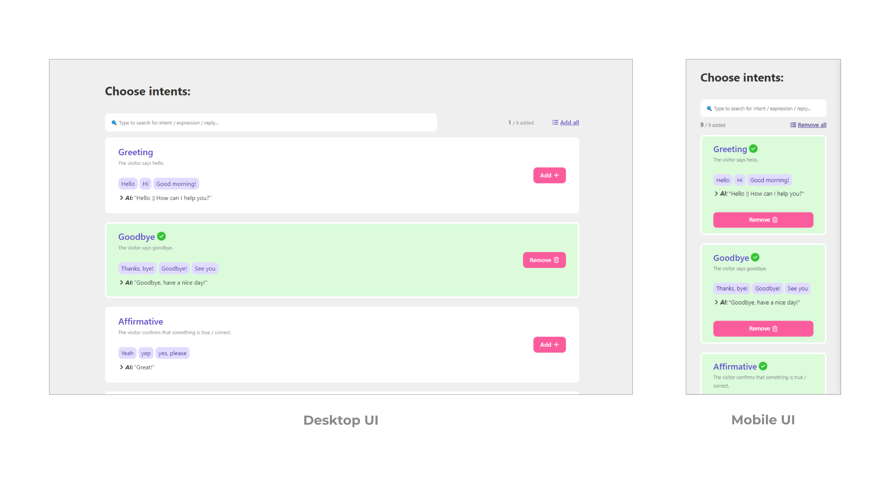

# AI Intents

The application lists a set of AI intents with the ability to search an intent or select intents.

See it here: https://arijitpatra.in/ai-intents/

Screenshot:

This project is made using ReactJS, Vite, TypeScript, CSS modules, Vitest, Testing Library React, Cypress.

## After thoughts

Used Vite (React/TypeScript) to create the application since it is the good practice.

I have used an array to handle the selection logic, other alternative data structure could be Set or Object.

The search is debounced and it searches across intent name or expressions or reply.

For testing used Vitest and testing-library/react for unit tests and Cypress for e2e.

Further improvement could be:

- Adding ErrorBoundary
- Moving the design system related components to a separate repo
- Adding more tests
- Accessing the intents/Search via API
- The code structure/architecture could be updated if the requirements or scope changes

## Installation

Run `npm install`

## Running the app

Run `npm run dev`, open localhost (it should be 5173 by default, check the port number in the terminal) in your browser to enjoy the app! 🚀

## Running unit tests

Run `npm run test`

## Running e2e tests

Run `npm run cy:open` (baseUrl has been configured as "http://localhost:5173")

